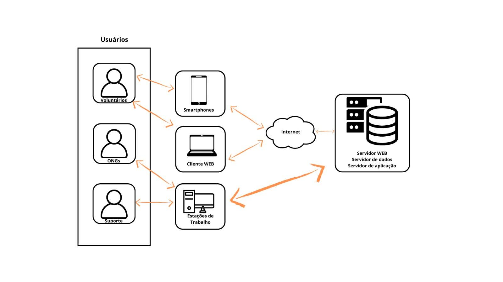

# Visão do Produto

## CommunityLink – Sistema de Voluntariado para Ações Comunitárias  
<small>Versão 1.0</small>

---

## Histórico de revisões

|    Data    | Versão |            Descrição            |       Autor        |
| :--------: | :----: | :-----------------------------: | :----------------: |
| 30/11/2024 |  1.0   |     Criação do documento        | Grupo CommunityLink |

---

## Sumário

- [Introdução](#introdução)  
  - [Propósito](#propósito)  
  - [Definições e abreviações](#definições-e-abreviações)  
    - [Abreviações](#abreviações)  
    - [Definições](#definições)  
  - [Escopo do produto](#escopo-do-produto)  
- [Posicionamento](#posicionamento)  
  - [Oportunidade de negócios](#oportunidade-de-negócios)  
  - [Descrição dos benefícios para os clientes e dos problemas resolvidos](#descrição-dos-benefícios-para-os-clientes-e-dos-problemas-resolvidos)  
- [Descrição dos stakeholders e dos usuários](#descrição-dos-stakeholders-e-dos-usuários)  
  - [Stakeholders](#stakeholders)  
  - [Usuários e atores](#usuários-e-atores)  
- [Descrição do ambiente de uso](#descrição-do-ambiente-de-uso)  
  - [Ambiente de uso](#ambiente-de-uso)  
  - [Necessidades principais quanto ao ambiente](#necessidades-principais-quanto-ao-ambiente)
- [Visão geral do produto](#visão-geral-do-produto)
  - [Visão geral](#visão-geral)
  - [Custo e venda](#custo-e-venda)
  - [Licenciamento e instalação](#licenciamento-e-instalação)
  - [Características e funcionalidades de alto nível](#características-e-funcionalidades-de-alto-nível)
  - [Restrições](#restrições)

---

# Introdução

O Documento de Visão do Produto (DVP) descreve o sistema de voluntariado **CommunityLink**, abordando como o produto resolverá desafios enfrentados por voluntários e organizadores de ações comunitárias. Este documento detalha o propósito, benefícios, funcionalidades de alto nível e restrições do projeto, etc.

## Propósito

O objetivo deste documento é coletar, organizar e detalhar as características de alto nível necessárias para o desenvolvimento do **CommunityLink**.  

O sistema busca:  
- Facilitar a conexão entre voluntários e organizadores de ações comunitárias.  
- Oferecer uma plataforma centralizada para gestão de eventos voluntários e acompanhamento de impacto social.  
- Atender a diversas necessidades de usuários, com ênfase na usabilidade, segurança e acessibilidade.

## Definições e abreviações

### Abreviações

| Termo | Definição                                    |
| :---: | -------------------------------------------- |
|  DVP  | Documento de Visão do Produto                |
|  LGPD | Lei Geral de Proteção de Dados               |
|  ONG  | Organização Não Governamental                |
| APP  | Aplicativo                                    |

### Definições

|    Termo     | Definição                                                                                                                                   |
| :----------: | ------------------------------------------------------------------------------------------------------------------------------------------- |
| Voluntário   | Pessoa física interessada em participar de ações comunitárias.                                                                              |
| Beneficiário | Pessoa ou grupo que recebe apoio ou ajuda por meio das ações organizadas.                                                                  |
| Organizador  | Responsável pela criação, divulgação e gerenciamento de ações voluntárias na plataforma.                                                    |
| Ação         | Evento ou atividade planejada e organizada para promover impacto social ou ambiental, contando com a participação de voluntários.           |
| Recompensa   | Sistema de pontuação ou reconhecimento para engajar e premiar os voluntários pelo impacto gerado.                                           |

---

## Escopo do produto

O **CommunityLink** é uma plataforma digital (web e mobile) voltada para conectar voluntários a ações comunitárias e facilitar a gestão de eventos por organizadores. O sistema permitirá:  
- Cadastro e divulgação de ações voluntárias.  
- Inscrição e acompanhamento por parte dos voluntários.  
- Comunicação eficiente entre voluntários e organizadores.  
- Monitoramento do impacto social e ambiental das ações realizadas.

Principais características:  
- Disponível para Android, iOS e navegadores web.  
- Usabilidade acessível para públicos com diferentes níveis de familiaridade tecnológica.  
- Conformidade com a LGPD para proteção de dados pessoais.

---  

## Posicionamento  

### Oportunidade de negócios  

O **CommunityLink** se posiciona como uma solução integrada para organizações e indivíduos engajados em atividades voluntárias. As oportunidades incluem:  
1. **Crescimento do voluntariado**: Facilitar o engajamento em ações sociais, conectando mais pessoas às iniciativas.  
2. **Parcerias com ONGs e empresas**: Oferecer recursos customizáveis para programas corporativos e iniciativas locais.  
3. **Inovação tecnológica**: Substituir métodos tradicionais e descentralizados, como redes sociais e e-mails, por uma plataforma única e otimizada.  
4. **Incentivo à responsabilidade social**: Aumentar o impacto de ações comunitárias ao simplificar a comunicação e o planejamento.  

### Descrição dos benefícios para os clientes e dos problemas resolvidos  

| Benefícios                        | Problemas Resolvidos                                              | Afetados                       |
| --------------------------------- | ----------------------------------------------------------------- | ------------------------------ |
| Plataforma centralizada           | Dificuldade em localizar e divulgar ações                        | Organizadores e voluntários    |
| Usabilidade acessível             | Ferramentas complicadas e descentralizadas                       | Voluntários de diferentes perfis |
| Acompanhamento do impacto         | Falta de monitoramento do impacto gerado pelas ações             | Organizadores e voluntários    |
| Engajamento por recompensas       | Baixa retenção de voluntários                                     | Voluntários                    |
| Notificações e lembretes          | Esquecimento de datas e informações importantes                  | Voluntários e organizadores    |
| Segurança e proteção de dados     | Riscos associados ao compartilhamento de informações pessoais     | Todos os usuários              |

---

# Descrição dos stakeholders e dos usuários

Esta seção descreve os stakeholders e os usuários do **CommunityLink**, a plataforma de gestão de voluntariado para ações comunitárias.

## Stakeholders

Segue abaixo a lista de stakeholders.

| Stakeholder                             | Descrição                                                                                                                                                   | Papel                                                           |
| --------------------------------------- | --------------------------------------------------------------------------------------------------------------------------------------------------------- | --------------------------------------------------------------- |
| ONGs e Organizações Comunitárias        | Organizações que promovem ações sociais e ambientais, buscando engajar voluntários para suas atividades.                                                   | Solicitantes do desenvolvimento do sistema                       |
| Empresas com Programas de Voluntariado  | Empresas que possuem programas internos de voluntariado e desejam engajar seus colaboradores em ações comunitárias.                                           | Solicitantes do desenvolvimento do sistema                       |
| Voluntários Individuais                 | Pessoas que se voluntariam para participar de ações sociais e ambientais organizadas através da plataforma.                                                  | Usuários do sistema                                              |
| Líderes de Projetos Comunitários        | Pessoas que organizam e coordenam ações comunitárias, responsáveis por gerenciar voluntários e divulgar ações.                                               | Usuários do sistema                                              |
| Administradores do Sistema              | Profissionais responsáveis pela gestão e manutenção da plataforma, como controle de usuários e dados.                                                       | Administradores                                                 |
| Equipe de Desenvolvimento               | Profissionais responsáveis pela criação, implementação e manutenção do sistema.                                                                          | Desenvolvedores                                                 |

## Usuários e atores

Segue tabela com os usuários e atores do sistema:

| Usuário                   | Descrição                                                                                                   | Responsabilidades                                                                                                                                                                                                                           | Stakeholders                                                                                      |
| ------------------------- | ----------------------------------------------------------------------------------------------------------- | ------------------------------------------------------------------------------------------------------------------------------------------------------------------------------------------------------------------------------------------ | ------------------------------------------------------------------------------------------------- |
| Voluntário                | Pessoas que buscam participar de ações comunitárias e engajamento em atividades sociais e ambientais.        | Buscar e se inscrever nas ações, acompanhar os impactos das atividades, receber notificações e relatórios pós-atividade.                                                                                                                     | ONGs e Organizações Comunitárias, Empresas com Programas de Voluntariado, Líderes de Projetos Comunitários |
| Líder de Projeto Comunitário | Pessoas responsáveis pela organização e gestão das ações comunitárias, incluindo o acompanhamento de voluntários e resultados. | Criar e gerenciar ações no sistema, gerenciar inscrições de voluntários, fornecer detalhes das atividades, acompanhar o impacto das ações.                                                                                                     | ONGs e Organizações Comunitárias, Voluntários, Administradores                                     |
| Administrador do Sistema  | Responsáveis por gerenciar a plataforma, dados dos usuários e garantir a integridade do sistema.             | Controlar permissões de usuários, realizar manutenções no sistema, configurar o acesso e garantir o bom funcionamento da plataforma.                                                                                                           | Equipe de Desenvolvimento, Líderes de Projetos Comunitários, Voluntários                         |

---

# Descrição do ambiente de uso

## Ambiente de uso

A seguir, são descritos alguns ambientes em que o **CommunityLink** pode ser utilizado:

1. **Ambiente do Voluntário**: Neste ambiente, os voluntários acessam a plataforma para pesquisar e se inscrever em ações comunitárias. O acesso é feito via aplicativo para Android e iOS ou por meio de navegadores web (Google Chrome, Mozilla Firefox, Microsoft Edge). O sistema permite buscar ações por localização e área de interesse, receber notificações de eventos e relatórios pós-atividade.
2. **Ambiente do Líder de Projeto Comunitário**: Os líderes de projetos acessam a plataforma para criar, gerenciar e divulgar suas ações, além de acompanhar o engajamento dos voluntários. O acesso é feito por navegador web em desktops ou dispositivos móveis. Eles podem criar eventos, visualizar voluntários inscritos e monitorar o impacto das ações.
3. **Ambiente Administrativo**: Este ambiente é utilizado pelos administradores do sistema para gerenciar usuários, dados e configurações da plataforma. O acesso é feito por navegadores web em desktops, e os administradores têm acesso completo a funcionalidades de controle e manutenção do sistema.

## Necessidades principais quanto ao ambiente

A seguir, é apresentada uma tabela que descreve as necessidades dos usuários com relação à qualidade, desempenho, segurança, usabilidade e confidencialidade do **CommunityLink**, juntamente com sua prioridade, interesse, solução atual e soluções propostas:

| Necessidade                                                                                                                                              | Prioridade | Interesse                                                                                                                                                | Solução Atual                                                                                                                 | Soluções Propostas                                                                                                                                                                                                                                                       |
| -------------------------------------------------------------------------------------------------------------------------------------------------------- | ---------- | -------------------------------------------------------------------------------------------------------------------------------------------------------- | ----------------------------------------------------------------------------------------------------------------------------- | ------------------------------------------------------------------------------------------------------------------------------------------------------------------------------------------------------------------------------------------------------------------------ |
| **Qualidade:** O sistema deve ser confiável, sem falhas durante o cadastro e o gerenciamento de ações.                                                   | Alta       | Os usuários esperam um sistema estável e sem falhas para realizar cadastros e gerenciar ações sem interrupções.                                           | Testes manuais e manutenção preventiva do sistema.                                                                           | Implementar testes automatizados e processos de monitoramento contínuo para garantir a integridade e a confiabilidade do sistema.                                                                                                                           |
| **Desempenho:** O sistema deve ser rápido, especialmente em regiões com internet limitada, e carregar informações em tempo real para engajamento imediato. | Alta       | Os voluntários e líderes de projeto necessitam de uma plataforma ágil, com baixo tempo de resposta, especialmente em locais com conexão limitada.          | Sistema otimizado para diferentes condições de rede.                                                                          | Otimizar o uso de recursos de rede e implementar uma infraestrutura em nuvem escalável para garantir a entrega de conteúdo rápido, com baixa latência, mesmo em regiões com internet limitada.                                                                      |
| **Escalabilidade:** O sistema deve suportar um grande número de usuários e ações registradas.                                                           | Alta       | A plataforma precisa ser capaz de lidar com um número crescente de usuários e ações sem comprometer a performance.                                          | Arquitetura básica de servidores dedicados.                                                                                   | Implementar soluções em nuvem com escalabilidade dinâmica, garantindo alta disponibilidade e resposta rápida conforme o número de acessos e ações cresce.                                                                                                           |
| **Segurança:** O sistema deve proteger dados pessoais e garantir a segurança nas interações entre voluntários e organizadores.                             | Alta       | Os usuários esperam que seus dados pessoais e interações estejam protegidos contra acessos não autorizados.                                              | Autenticação básica de usuários e criptografia de dados.                                                                     | Implementar autenticação multifatorial, criptografia avançada de dados, e políticas de segurança rigorosas de acordo com a LGPD.                                                                                                                               |
| **Usabilidade:** A interface precisa ser intuitiva e fácil de usar, com navegação clara e categorização eficiente das ações.                               | Moderada   | A experiência do usuário deve ser simples e agradável, para que qualquer tipo de usuário consiga utilizar a plataforma com facilidade.                      | Interface simples, mas com oportunidades de melhoria na navegação e categorização.                                                                                                      | Realizar testes de usabilidade com diferentes perfis de usuários, ajustar a navegação e categorizar as ações por temas e localização de forma mais eficiente, oferecendo personalização da experiência.                                                                 |
| **Tempo de resposta:** O sistema deve ter um tempo de resposta rápido durante o uso da plataforma.                                                        | Moderada   | Os voluntários e líderes de projeto esperam uma plataforma que responda rapidamente às interações, como inscrições e visualização de ações.               | Monitoramento de desempenho em tempo real.                                                                                     | Implementar cache para dados mais utilizados, otimizar consultas e garantir que a plataforma tenha tempos de resposta menores para interações simples, como inscrições e atualizações.                                                                                 |
| **Confidencialidade:** A plataforma deve proteger a privacidade das informações dos usuários, conforme a Lei Geral de Proteção de Dados (LGPD).         | Alta       | Os dados dos usuários, como informações pessoais e localização, precisam ser tratados de maneira segura e sigilosa.                                       | Políticas de privacidade e controle de acesso aos dados sensíveis.                                                           | Implementar protocolos rigorosos de privacidade e consentimento explícito do usuário, garantindo conformidade com a LGPD e a proteção total dos dados.                                                                                                            |

--- 

Aqui está a versão reformulada com base nas informações fornecidas:

---

# Visão Geral do Produto

## Visão Geral

O **CommunityLink** é uma plataforma digital inovadora voltada para o engajamento e o gerenciamento de ações voluntárias em comunidades sociais e ambientais. O sistema tem como objetivo facilitar a interação entre voluntários e organizações, proporcionando ferramentas para cadastrar e divulgar ações, conectar organizadores e participantes, além de permitir o acompanhamento do impacto das atividades realizadas.

O **CommunityLink** será uma plataforma acessível via dispositivos móveis e web, proporcionando uma experiência fluída em diversos tipos de dispositivos (smartphones, tablets e desktops). Sua infraestrutura será hospedada na nuvem, garantindo alta disponibilidade, escalabilidade e segurança, com um banco de dados robusto e servidores confiáveis para o processamento de dados.

Com uma arquitetura cliente-servidor, os usuários interagem com o sistema por meio de uma interface intuitiva, enquanto os processos e dados são gerenciados em servidores dedicados. A comunicação entre o cliente e o servidor será feita via HTTPS, assegurando a proteção dos dados.

Além disso, o **CommunityLink** será totalmente integrável com outros sistemas, ferramentas de CRM e soluções de análise de dados, por meio de APIs. Essa capacidade de integração amplia as funcionalidades do sistema, oferecendo mais automação e personalização para as organizações e voluntários.

Uma visualização da arquitetura do sistema pode ser vista abaixo:

**Figura 1** - Arquitetura do sistema CommunityLink

## Custo e Venda

O **CommunityLink** adota um modelo de assinatura comunitária em que os voluntários, as ONGs e as empresas associadas contribuem voluntariamente para manutenção da hospedagem da aplicação como também para possíveis ajustes da ferramenta.
## Licenciamento e Instalação

O **CommunityLink** será oferecido como um serviço SaaS (Software como Serviço), o que elimina a necessidade de instalação local e permite acesso direto à plataforma pela web. As atualizações do sistema serão automáticas, e o suporte será contínuo para garantir o bom funcionamento da plataforma.

## Características e Funcionalidades de Alto Nível

1. **Cadastro de Membros e Comunidades**: Permite a criação de perfis de usuários e comunidades, com controle de permissões e gerenciamento de dados pessoais.
2. **Gerenciamento de Eventos**: Ferramentas para organizar e divulgar ações, incluindo a possibilidade de RSVP, notificações e relatórios de participação.
3. **Discussões e Enquetes**: Funcionalidades para promover debates e decisões coletivas por meio de fóruns temáticos e enquetes.
4. **Compartilhamento de Informações**: Ferramentas seguras para upload e compartilhamento de documentos, fotos e outros conteúdos, com controle de acesso.
5. **Personalização**: O sistema pode ser adaptado a diferentes necessidades de comunidade, com opções de customização de interface e recursos.
6. **Análises e Relatórios**: Oferece relatórios detalhados sobre engajamento, participação e outros KPIs importantes para as organizações.
7. **Alta Disponibilidade e Desempenho**: O sistema foi projetado para garantir tempos de resposta rápidos e operação estável, mesmo com grande volume de usuários.
8. **Conformidade com a LGPD**: O sistema segue as normas de privacidade e proteção de dados exigidas pela LGPD, com criptografia e práticas de segurança adequadas.

## Restrições

1. **Restrição de Orçamento**: O desenvolvimento e operação do sistema devem se manter dentro dos limites orçamentários definidos.
2. **Restrição de Tempo**: A entrega inicial deve ocorrer em até seis meses, com entregas incrementais a cada quatro semanas.
3. **Restrição de Hardware**: O sistema será 100% baseado em nuvem, eliminando a necessidade de infraestrutura de hardware local.
4. **Segurança e Privacidade**: O sistema precisa aderir às regulamentações de segurança, como a LGPD, e implementar criptografia de ponta a ponta para dados sensíveis.
5. **Usabilidade**: O sistema deve ser acessível a usuários com diferentes níveis de familiaridade tecnológica, incluindo funcionalidades para acessibilidade.
6. **Interoperabilidade**: O sistema deverá permitir integração com APIs de terceiros para ampliar suas funcionalidades.
7. **Desempenho**: O sistema deve ser capaz de suportar até 10.000 usuários simultâneos na versão inicial, com escalabilidade para aumentar esse limite conforme necessário.
8. **Idioma**: O sistema será multilíngue, com suporte a pelo menos três idiomas: português, inglês e espanhol.

---

**Data:** 30 de novembro de 2024  

**Validado por:**  

<address>
<a href="mailto:dg.jpa@ifpb.edu.br">IFPB - Campus João Pessoa</a> | Sistemas para Internet 
cstsi@ifpb.edu.br 
CommunityLink 
Av. Primeiro de Maio, 720 - Jaguaribe, João Pessoa - PB, 58015-435 
BRA
</address>

---  
Criado em Novembro de 2024 por Ananda Guedes, Angélica Araújo, Letícia Leite e Maira Fernandes.
