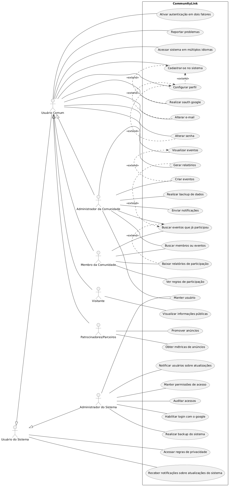

<h6>"Na prática e, no mínimo, nesta primeira etapa, será gerado um diagrama de casos de uso (geral) contendo caso de uso para cada um dos requisitos (a depender da análise)."</h6>

# Capa

---

<h1>Diagramas de Casos de Uso</h1>

<h2>CommunityLink</h2>

<small>Versão 1.0</small>

---

## Histórico de revisões

|    Data    | Versão |          Descrição          |      Autor       |
| :--------: | :----: | :-------------------------: | :--------------: |
| 11/02/2025 |  1.0   |    Criação do documento     | Ananda Guedes, Angélica Araújo, Letícia Leite e Maira Fernandes |

---

## Sumário

- [Capa](#capa)
  - [Histórico de revisões](#histórico-de-revisões)
  - [Sumário](#sumário)
- [Diagrama de Casos de Uso Geral](#diagrama-de-casos-de-uso-geral)
  - [Código UML](#código-uml)
  - [Especificação Descritiva dos Casos de Uso](#especificação-descritiva-dos-casos-de-uso)

---
## Diagrama de Casos de Uso Geral

**Figura 1** - Diagrama de Casos de Uso Geral do CommunityLink

## Código UML

[Ver código](uml-geral.md)

## Especificação Descritiva dos Casos de Uso

### Caso de Uso UC01 - Criar eventos

**Objetivo**
Permitir que o ator crie eventos na plataforma para organização de atividades comunitárias.

**Requisitos**
RF001

**Atores**
Administrador da Comunidade

**Condição de entrada**
O ator deve estar está logado no sistema e acessa a opção de criar um novo evento.

**Fluxo principal**
1. O ator acessa a opção "Criar Evento" no sistema.
2. O sistema exibe um formulário para preenchimento dos seguintes campos:
- Título do evento
- Data e horário
- Descrição
- Local
- Lista de participantes (opcional)
3. O sistema valida os dados informados. EX1
4. O sistema armazena as informações do evento. EX2
5. O sistema confirma a criação do evento e notifica os participantes.

**Fluxos alternativos**
- FA1 - Adicionar participantes posteriormente: Caso o ator não insira a lista de participantes no momento da criação, ele poderá adicioná-los posteriormente na funcionalidade "Manter cadastro".

**Fluxos de exceção**
- [EX1 - Validação de campos]: Se algum campo obrigatório não for preenchido, o sistema exibe uma mensagem de erro e solicita a correção.
- [EX2 - Erro de conexão]: Se houver falha na comunicação com o servidor, o sistema exibe uma mensagem de erro e solicita que o usuário tente novamente mais tarde.

---

### Caso de Uso UC02 - Realizar backup de dados

**Objetivo**
Permitir que o ator faça backup dos dados da plataforma para garantir a segurança da informação.

**Requisitos**
RF002

**Atores**
Administrador da Comunidade

**Condição de entrada**
O ator deve estar autenticado no sistema e acessar a opção de backup de dados.

**Fluxo principal**
1. O ator acessa a opção "Realizar Backup" no sistema.
2. O sistema verifica se há espaço disponível para o backup.
3. O sistema gera um arquivo contendo os dados.
4. O sistema verifica a integridade dos dados copiados. EX1
5. O sistema disponibiliza o arquivo para download. EX2
6. O sistema armazena o backup em um local seguro e exibe uma confirmação ao ator.

**Fluxos alternativos**
Nenhum.

**Fluxos de exceção**
- [EX1 - Falta de espaço]: Se não houver espaço suficiente, o sistema exibe uma mensagem de erro e sugere a exclusão de backups antigos.
- [EX2 - Falha na conexão]: Se a conexão com o servidor for interrompida, o sistema informa o erro e solicita que o ator tente novamente.

---

### Caso de Uso UC03 - Enviar notificações

**Objetivo**
Permitir que o ator envie notificações para os membros informando sobre atualizações ou eventos futuros.

**Requisitos**
RF003

**Atores**
Administrador da Comunidade

**Condição de entrada**
O ator deve estar logado no sistema e acessar a funcionalidade de envio de notificações.

**Fluxo principal**
1. O ator acessa a opção "Enviar Notificação" no sistema.
2. O sistema exibe um formulário para preenchimento da mensagem.
3. O ator define os destinatários (todos os membros ou um grupo específico).
4. O sistema valida a mensagem e os destinatários. EX1
5. O sistema envia as notificações.
6. O sistema confirma o envio e exibe um resumo das mensagens enviadas.

**Fluxos alternativos**
- Nenhum

**Fluxos de exceção**
- [EX1 - Validação de campos]: Se algum campo estiver inválido, o sistema exibe um erro e solicita correção.
- [EX2 - Falha no envio]: Se houver falha no envio das notificações, o sistema informa ao ator e permite uma nova tentativa.

---

### Caso de Uso UC04 - Manter usuário

**Objetivo**
Permitir que o ator gerencie os usuários cadastrados, podendo removê-los caso necessário.

**Requisitos**
RF004

**Atores**
Administrador da Comunidade e Administrador do Sistema

**Condição de entrada**
O ator deve estar logado no sistema e acessar a opção de manutenção de usuário.

**Fluxo principal**
1. O ator acessa a opção "Manter Usuário" no sistema.
2. O sistema exibe a lista de usuários cadastrados.
3. O ator pode adicionar, editar ou excluir um usuário. EX1
4. O sistema valida os dados inseridos. EX2 
5. O sistema armazena as alterações e exibe uma confirmação. EX3

**Fluxos alternativos**
- FA1 - Filtrar membros: O ator pode buscar membros por nome ou e-mail.

**Fluxos de exceção**
- [EX1 - Remoção de membros]: Não é possível remover um administrador sem atribuir suas funções a outro usuário.
- [EX2 - Dados inválidos]: Se os dados inseridos estiverem incorretos, o sistema exibe um erro e solicita correção.
- [EX3 - Exclusão lógica]: Se um membro for removido, o sistema apenas altera seu status sem excluí-lo permanentemente.

---

### Caso de Uso UC05 - Gerar relatórios

**Objetivo**
Permitir que o ator gere relatórios sobre a participação dos membros em eventos e atividades.

**Requisitos**
RF005

**Atores**
Administrador da Comunidade

**Condição de entrada**
O ator deve estar autenticado no sistema e acessar a funcionalidade de relatórios.

**Fluxo principal**
1. O ator acessa a opção "Gerar Relatórios" no sistema.
2. O ator define os filtros desejados (tipo de evento, data, participantes, doações). EX1
3. O sistema processa as informações e gera o relatório. EX2
4. O sistema disponibiliza o relatório para visualização e download.

**Fluxos alternativos**
Nenhum.

**Fluxos de exceção**
- [EX1 - Nenhum dado disponível]: Se não houver dados para o filtro selecionado, o sistema informa ao ator.
- [EX2 - Erro ao gerar relatório]: Se houver falha no processamento, o sistema exibe uma mensagem de erro.

---

### Caso de Uso UC06 - Cadastrar-se no sistema

**Objetivo**
Permitir que o ator crie uma conta na plataforma, fornecendo informações básicas.

**Requisitos**
RF200

**Atores**
Usuário Comum

**Condição de entrada**
O ator acessa a página de cadastro do sistema.

**Fluxo principal**
1. O ator acessa a opção "Cadastrar-se" no sistema.
2. O sistema exibe um formulário de cadastro.
3. O ator preenche os campos obrigatórios (nome, e-mail, senha). EX1, EX2
4. O sistema valida os dados informados.
5. O sistema cria a conta do usuário.
6. O sistema envia um e-mail de confirmação.
7. O usuário confirma o cadastro através do e-mail.
8. O sistema ativa a conta do usuário.

**Fluxos alternativos**
- FA1 - Login pelo Google: O ator pode se cadastrar com sua conta do Google, conforme RF502 e o caso de uso "Realizar oauth google".

**Fluxos de exceção**
- [EX1 - E-mail já cadastrado]: Se o e-mail informado já estiver registrado, o sistema exibe uma mensagem de erro.
- [EX2 - Senha fraca]: Se a senha não atender aos critérios de segurança, o sistema solicita uma senha mais forte.

---

### Caso de uso UC07 - Visualizar eventos
**Objetivo:** Permitir que os atores visualizem os eventos disponíveis na plataforma.

**Requisitos:** RF201

**Atores:** Usuário Comum

**Condição de entrada:** O ator acessa a plataforma e seleciona a opção ‘Eventos ativos’.

**Fluxo principal:**  
1. O ator acessa a opção ‘Eventos ativos’ no menu principal.  
2. O sistema exibe a lista de eventos disponíveis.  
3. O ator pode aplicar filtros de busca (categoria, data, local).  
4. O sistema exibe os eventos de acordo com os filtros aplicados. EX1  

**Fluxos alternativos:** Nenhum.  

**Fluxos de exceção:**  
- [EX1 - Nenhum evento disponível]: Caso não haja eventos ativos, o sistema informa o usuário.

---

### Caso de uso UC08 - Configurar perfil
**Objetivo:** Permitir que o ator edite suas informações pessoais e preferências dentro da plataforma.

**Requisitos:** RF202

**Atores:** Usuário Comum

**Condição de entrada:** O ator deve estar logado e acessar a opção "Configurar perfil".

**Fluxo principal:**  
1. O ator acessa a opção ‘Configurar perfil’.  
2. O sistema exibe o formulário de edição do perfil.  
3. O ator pode editar os seguintes campos: nome, e-mail, telefone, imagem de perfil e preferências.  
4. O sistema valida e salva as alterações. EX1  

**Fluxos alternativos:** Nenhum.  

**Fluxos de exceção:**  
- [EX1 - Validação de campos]: Todos os campos obrigatórios devem ser preenchidos corretamente.

---

### Caso de uso UC09 - Buscar eventos que já participou
**Objetivo:** Permitir que o ator encontre eventos anteriores em que esteve presente.

**Requisitos:** RF203

**Atores:** Administrador da Comunidade, Membro da Comunidade

**Condição de entrada:** O ator deve estar logado na plataforma e acessar a opção "Meus eventos".

**Fluxo principal:**  
1. O ator acessa a opção ‘Meus eventos’ no menu principal.  
2. O sistema exibe a lista de eventos já participados pelo ator. EX1  
3. O ator pode buscar eventos por data, nome ou categoria.  
4. O sistema exibe os eventos conforme os filtros aplicados.  

**Fluxos alternativos:** Nenhum.  

**Fluxos de exceção:**  
- [EX1 - Nenhum evento encontrado]: Caso o usuário não tenha participado de eventos, o sistema informa.

---

### Caso de uso UC10 - Ver regras de participação
**Objetivo:** Permitir que atores consultem as diretrizes e regras para participação em eventos.

**Requisitos:** RF204

**Atores:** Membro da Comunidade

**Condição de entrada:** O ator deve estar logado e acessar a opção "Regras de participação".

**Fluxo principal:**  
1. O ator acessa a seção ‘Regras de participação’.  
2. O sistema exibe o conjunto de diretrizes e regras.  
3. O ator pode pesquisar por palavras-chave ou categorias de regras.  

**Fluxos alternativos:** Nenhum.  

**Fluxos de exceção:** Nenhum.  

---

### Caso de uso UC11 - Baixar relatórios de participação
**Objetivo:** Permitir que atores façam o download de relatórios sobre sua participação em eventos.

**Requisitos:** RF205

**Atores:** Membro da Comunidade

**Condição de entrada:** O ator deve estar logado e acessar a opção "Meus relatórios".

**Fluxo principal:**  
1. O ator acessa a seção ‘Meus relatórios’.  
2. O sistema exibe a lista de eventos participados.  
3. O ator seleciona um evento e solicita a geração do relatório.  
4. O sistema gera um relatório em formato PDF ou CSV. EX1  
5. O ator realiza o download do relatório.  

**Fluxos alternativos:** Nenhum.  

**Fluxos de exceção:**  
- [EX1 - Falha na geração do relatório]: Caso ocorra um erro, o sistema exibe uma mensagem e permite uma nova tentativa.

---

### Caso de uso UC12 - Buscar membros ou eventos
**Objetivo:** Permitir que atores encontrem outros membros ou eventos dentro da plataforma.

**Requisitos:** RF206

**Atores:** Administrador da Comunidade, Membro da Comunidade

**Condição de entrada:** O ator acessa a plataforma e seleciona a opção ‘Buscar’.

**Fluxo principal:**  
1. O ator acessa a opção de busca.  
2. O sistema exibe um campo de pesquisa e filtros para membros ou eventos.  
3. O ator escolhe buscar a categoria membro ou evento e aplica filtros (nome, data, local).
4. O sistema busca os registros correspondentes no banco de dados. EX1
5. O sistema exibe os resultados correspondentes. EX2  

**Fluxos alternativos:** Nenhum.  

**Fluxos de exceção:**  
- [EX1 - Nenhum resultado encontrado]: Caso a busca não retorne resultados, o sistema informa o usuário.
- [EX2 - Erro na conexão com o banco de dados] - Erro na conexão com o banco de dados: Caso ocorra uma falha na comunicação, o sistema exibe uma mensagem de erro e sugere tentar novamente mais tarde.

---

### Caso de uso UC13 - Visualizar informações públicas
**Objetivo:** Permitir que o ator tenha acesso a informações públicas da plataforma, como eventos disponíveis e regras gerais.

**Requisitos:** RF300

**Atores:** Visitante

**Condição de entrada:** O ator acessa a plataforma sem necessidade de login.

**Fluxo principal:**  
1. O ator acessa a plataforma.  
2. O sistema exibe informações públicas, como eventos abertos e regras gerais.  
3. O ator pode navegar pelas informações sem restrições.  

**Fluxos alternativos:** Nenhum.  

**Fluxos de exceção:** Nenhum.

---

### Caso de uso UC14 - Promover anúncios
**Objetivo:** Permitir que o ator promova anúncios na plataforma para divulgar produtos e serviços.

**Requisitos:** RF400

**Atores:** Patrocinadores/Parceiros

**Condição de entrada:** O ator acessa a plataforma e seleciona a opção ‘Promover anúncios’.

**Fluxo principal:**  
1. O ator acessa a opção ‘Promover anúncios’ no menu principal.  
2. O sistema exibe um formulário para criação de anúncio.  
3. O ator preenche os detalhes do anúncio (título, descrição, imagem, público-alvo, orçamento, duração do anúncio).  
4. O sistema valida as informações. EX1  
5. O ator confirma o pagamento do anúncio. EX2  
6. O sistema processa o pagamento e ativa o anúncio pelo período pago.  
7. O sistema disponibiliza métricas sobre o desempenho do anúncio.  

**Fluxos alternativos:**  
- FA1: O ator deseja editar um anúncio já existente:  
  1. O ator acessa a lista de anúncios criados.  
  2. O ator seleciona um anúncio e edita as informações.  
  3. O sistema valida e salva as alterações.
- FA2: O ator deseja visualizar um anúncio antes de publicar:
  1. O sistema disponibiliza um modo de pré-visualização do anúncio.
  2. O ator revisa as informações e confirma ou edita o anúncio antes da publicação.

**Fluxos de exceção:**  
- [EX1 - Validação de dados]: Todos os campos obrigatórios devem ser preenchidos.  
- [EX2 - Pagamento não autorizado]: Caso o pagamento falhe, o sistema informa o erro e solicita uma nova tentativa.  

---

### Caso de uso UC15 - Obter métricas de anúncios
**Objetivo:** Permitir que o ator obtenha métricas sobre o desempenho de seus anúncios.

**Requisitos:** RF401

**Atores:** Patrocinadores/Parceiros

**Condição de entrada:** O ator acessa a plataforma e seleciona a opção ‘Métricas de anúncios’.

**Fluxo principal:**  
1. O ator acessa a seção de métricas na plataforma.  
2. O sistema exibe uma lista de anúncios promovidos pelo ator.  
3. O ator seleciona um anúncio para visualizar métricas detalhadas. EX1 
4. O sistema exibe informações como número de visualizações, cliques, engajamento e conversões.  
5. O ator pode exportar os dados para um relatório. EX2 

**Fluxos alternativos:**  
- FA1: O ator deseja comparar métricas de diferentes anúncios:  
  1. O sistema permite a seleção de múltiplos anúncios.  
  2. O sistema exibe uma comparação entre os anúncios selecionados.
- FA2 - O ator deseja aplicar filtros:
  1. O ator seleciona um intervalo de tempo ou público-alvo específico.
  2. O sistema ajusta a exibição das métricas de acordo com os filtros aplicados. 

**Fluxos de exceção:**  
- [EX1 - Nenhuma métrica disponível]: Caso um anúncio ainda não tenha métricas suficientes, o sistema informa ao ator.  
- [EX2- Problemas na exportação]: Caso ocorra uma falha na geração do relatório, o sistema exibe uma mensagem de erro e sugere uma nova tentativa.

---

### Caso de uso UC16 - Manter permissões de acesso
**Objetivo:** Permitir que o ator gerencie o acesso dos usuários à plataforma.

**Requisitos:** RF500

**Atores:** Administrador do Sistema

**Condição de entrada:** O ator acessa o painel de administração e seleciona a opção ‘Gerenciar login e acessos’.

**Fluxo principal:**  
1. O ator acessa a opção ‘Gerenciar login e acessos’.  
2. O sistema exibe a lista de usuários cadastrados.  
3. O ator pode ativar, desativar ou redefinir acessos de usuários.  
4. O sistema aplica as mudanças e notifica os usuários afetados. EX2  

**Fluxos alternativos:**
- FA1 - O ator deseja buscar um usuário específico: 
  1. O ator insere um nome ou e-mail no campo de busca. EX1
  2. O sistema exibe o usuário correspondente para edição.

**Fluxos de exceção:**  
- [EX1 - Usuário não encontrado]: Caso o usuário não esteja cadastrado, o sistema exibe uma mensagem de erro.  
- [EX2 - Falha na atualização]: Caso ocorra erro ao salvar as alterações, o sistema exibe uma mensagem e sugere nova tentativa.  

---

### Caso de uso UC17 - Realizar backup do sistema
**Objetivo:** Permitir que o ator realize backups dos dados da plataforma.

**Requisitos:** RF501

**Atores:** Administrador do Sistema

**Condição de entrada:** O ator acessa a plataforma e seleciona a opção ‘Backup do sistema’.

**Fluxo principal:**  
1. O ator acessa a opção ‘Backup do sistema’.  
2. O sistema exibe as opções de backup disponíveis.  
3. O ator seleciona a opção desejada e inicia o backup.  
4. O sistema processa e armazena o backup.  
5. O sistema notifica o sucesso da operação. EX1  

**Fluxos alternativos:**
- FA1 - O ator deseja agendar backups automáticos:
  1. O sistema exibe opções de agendamento.
  2. O ator configura a periodicidade do backup.
  3. O sistema agenda a execução automática.

**Fluxos de exceção:**  
- [EX1 - Falha no backup]: Caso ocorra erro, o sistema exibe mensagem e sugere nova tentativa.  

---

### Caso de uso UC18 - Habilitar login com Google
**Objetivo:** Permitir que os usuários façam login utilizando sua conta Google.

**Requisitos:** RF502

**Atores:** Administrador do Sistema

**Condição de entrada:** O ator acessa a plataforma e seleciona a opção ‘Habilitar login com Google’.

**Fluxo principal:**  
1. O ator acessa as configurações de autenticação.  
2. O sistema exibe a opção para ativar login com Google.  
3. O ator habilita a opção e fornece as credenciais necessárias.  
4. O sistema configura a autenticação e salva as alterações.
5. O sistema exibe uma mensagem de sucesso.  

**Fluxos alternativos:** Nenhum.  

**Fluxos de exceção:** Nenhum. 

---

### Caso de uso UC19 - Notificar usuários sobre atualizações
**Objetivo:** Permitir que o ator envie notificações sobre atualizações da plataforma.

**Requisitos:** RF503

**Atores:** Administrador do Sistema

**Condição de entrada:** O ator acessa a plataforma e seleciona a opção ‘Notificar usuários’.

**Fluxo principal:**  
1. O ator acessa a seção de notificações.  
2. O sistema exibe um formulário para envio da notificação.  
3. O ator redige a mensagem e seleciona o público-alvo. EX2
4. O sistema exibe um resumo da notificação antes do envio.
5. O ator confirma o envio. EX1
6. O sistema envia a notificação para os usuários.  

**Fluxos alternativos:**
- FA1 - Edição antes do envio: O ator pode editar a notificação antes da confirmação.

**Fluxos de exceção:**  
- [EX1 - Falha no envio]: Se a notificação não for enviada, o sistema exibe um erro e permite nova tentativa.
- [EX2 - Destinatários inválidos]: Se a lista de destinatários for inválida, o sistema exibe um alerta e sugere correção.

---

### Caso de uso UC20 - Acessar regras de privacidade
**Objetivo:** Permitir que os usuários consultem as regras de privacidade da plataforma.

**Requisitos:** RF600

**Atores:** Usuário do Sistema

**Condição de entrada:** O ator acessa a plataforma e seleciona a opção ‘Regras de privacidade’.

**Fluxo principal:**  
1. O ator acessa a seção ‘Regras de privacidade’.  
2. O sistema exibe as diretrizes de privacidade.  
3. O ator pode pesquisar ou filtrar regras específicas.
4. O sistema apresenta os resultados correspondentes. EX1

**Fluxos alternativos:**
- FA1 - Download das regras: O ator pode baixar o documento completo das regras de privacidade.

**Fluxos de exceção:**
- [EX1 - Falha no carregamento]: Se o sistema não conseguir carregar as regras, exibe uma mensagem de erro e sugere nova tentativa.

---

### Caso de uso UC21 - Alterar e-mail
**Objetivo:** Permitir que o usuário atualize seu e-mail cadastrado.

**Requisitos:** RF601

**Atores:** Usuário Comum

**Condição de entrada:** O ator acessa a opção ‘Configurações de conta’.

**Fluxo principal:**  
1. O ator acessa as configurações de conta.  
2. O sistema exibe a opção para alterar e-mail.  
3. O ator insere o novo e-mail e confirma. EX1, EX2  
4. O sistema valida e salva a alteração.  
5. O sistema envia um e-mail de confirmação para o novo endereço.
6. O ator confirma a alteração através do link recebido.  

**Fluxos alternativos:**
- FA1 - Cancelamento: O ator pode cancelar a alteração antes da confirmação.

**Fluxos de exceção:**  
- [EX1 - E-mail inválido]: Caso o e-mail fornecido seja inválido, o sistema exibe um erro.
- [EX2 - E-mail já cadastrado]: Se o e-mail já estiver vinculado a outra conta, o sistema informa o erro e solicita um novo endereço.  

---

### Caso de uso UC22 - Alterar senha
**Objetivo:** Permitir que o usuário altere sua senha.

**Requisitos:** RF602

**Atores:** Usuário Comum

**Condição de entrada:** O ator acessa a opção ‘Configurações de conta’.

**Fluxo principal:**  
1. O ator acessa as configurações de conta.  
2. O sistema exibe a opção para alterar senha.  
3. O ator insere a senha atual e a nova senha. EX1, EX2 
4. O sistema valida e salva a alteração.
5. O sistema exibe uma mensagem de confirmação.

**Fluxos alternativos:** Nenhum.  

**Fluxos de exceção:**  
- [EX1 - Senha inválida]: Caso a senha não cumpra os requisitos mínimos, o sistema exibe um erro.
- [EX2 - Senha incorreta] Se a senha atual estiver incorreta, o sistema exibe um erro e solicita nova tentativa.

---

### Caso de uso UC23 - Ativar autenticação em dois fatores
**Objetivo:** Permitir que o ator ative a autenticação em dois fatores (2FA).

**Requisitos:** RF603

**Atores:** Usuário Comum

**Condição de entrada:** O ator acessa a opção ‘Configurações de segurança’.

**Fluxo principal:**  
1. O ator acessa a seção de segurança.  
2. O sistema exibe a opção para ativar 2FA.  
3. O ator ativa a opção e escolhe o método de autenticação (SMS ou aplicativo autenticador). 
4. O sistema gera e exibe um código de verificação.  
5. O ator insere o código e confirma a ativação. EX1
6. O sistema exibe uma mensagem de sucesso. EX2  

**Fluxos alternativos:**
- FA1 - Redefinição de 2FA: O ator pode remover ou alterar o método de autenticação.

**Fluxos de exceção:**  
- [EX1 - Código inválido]: Caso o código inserido seja incorreto, o sistema exibe um erro e solicita novo código.
- [EX2 - Falha na configuração] Se houver erro interno, o sistema exibe uma mensagem e sugere nova tentativa. 

---

### Caso de uso UC24 - Reportar problemas
**Objetivo:** Permitir que o ator comunique problemas encontrados no sistema.

**Requisitos:** RF605

**Atores:** Usuário Comum

**Condição de entrada:** O ator deseja relatar um problema técnico ou operacional no sistema.

**Fluxo principal:**  
1. O ator acessa a opção “Reportar Problema” no menu de configurações.  
2. O sistema exibe um formulário estruturado para preenchimento dos detalhes do problema, incluindo descrição, tipo de problema e informações adicionais.
3. O ator preenche as informações solicitadas e envia o formulário. EX1
4. O sistema valida os dados fornecidos e registra o problema.
5. O sistema exibe uma confirmação de envio bem-sucedido e notifica a equipe de suporte.

**Fluxos alternativos:** Nenhum.  

**Fluxos de exceção:**  
- [EX1 - Dados Incompletos]: Se o usuário não preencher todos os campos obrigatórios, o sistema exibe uma mensagem de erro informando quais informações estão pendentes e solicita a correção antes do envio.

---

### Caso de uso UC25 - Receber notificações de manutenção
**Objetivo:** Permitir que o ator seja informado sobre manutenções programadas no sistema.

**Requisitos:** RF606

**Atores:** Usuário do Sistema

**Condição de entrada:** O ator deve ser notificado sobre as manutenções no sistema.

**Fluxo principal:**  
1. O sistema detecta que há uma manutenção programada.  
2. O sistema envia uma notificação para os atores sobre a data, horário e duração da manutenção.  
3. O ator recebe a notificação e pode consultar detalhes sobre a manutenção, se necessário. EX1  

**Fluxos alternativos:** Nenhum.  

**Fluxos de exceção:**  
- [EX1 - Falha ao enviar notificação]: Se houver erro no envio da notificação, o sistema registra a falha e tenta reenviar automaticamente. Caso o problema persista, um alerta é gerado para os administradores do sistema.  

---

### Caso de uso UC26 - Acessar sistema em múltiplos idiomas
**Objetivo:** Oferecer suporte a múltiplos idiomas, permitindo que os atores escolham e utilizem o sistema no idioma de sua preferência.

**Requisitos:** RF607

**Atores:** Usuário Comum

**Condição de entrada:** O ator deseja acessar o sistema em um idioma diferente do padrão.

**Fluxo principal:**  
1. O ator acessa o sistema.  
2. O sistema apresenta uma opção para selecionar o idioma preferido.  
3. O ator escolhe o idioma desejado (inglês, espanhol ou português).  
4. O sistema exibe a interface do usuário no idioma selecionado. EX1  

**Fluxos alternativos:** Nenhum.  

**Fluxos de exceção:**  
- [EX1 - Idioma não disponível]: Caso o idioma selecionado não esteja disponível, o sistema exibe uma mensagem informando sobre a indisponibilidade e mantém o idioma padrão.

---

### Caso de uso UC27 - Auditar Acessos
**Objetivo:** Permitir que o Administrador do sistema do Community Link monitore e revise os acessos realizados pelos usuários, garantindo segurança e conformidade com as políticas da plataforma.

**Requisitos:** RF500

**Atores:** Administrador do sistema

**Condição de entrada:** O ator deseja visualizar o histórico de acessos ao sistema para auditoria e verificação de atividades suspeitas.

**Fluxo principal:**  
1. O ator acessa o painel de administração.
2. O sistema exibe a opção "Auditoria de Acessos".
3. O ator seleciona filtros para refinar a busca, como período, usuário específico ou tipo de acesso.
4. O sistema exibe a lista de registros de acesso, incluindo informações como data, horário, IP e tipo de ação realizada. EX1
5. O ator pode exportar os dados para análise externa, se necessário.

**Fluxos alternativos:** Nenhum.  

**Fluxos de exceção:**  
- [EX1 - Falha na Consulta]: Caso ocorra um erro ao recuperar os registros de acesso, o sistema exibe uma mensagem de erro e sugere uma nova tentativa.

---
