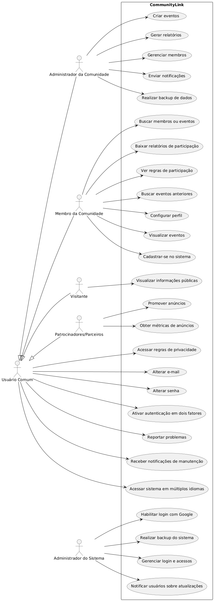

Na prática e, no mínimo, nesta primeira etapa, será gerado um diagrama de casos de uso (geral) contendo caso de uso para cada um dos requisitos (a depender da análise).
---

**Figura 1** - Diagrama de Uso Geral do CommunityLink
