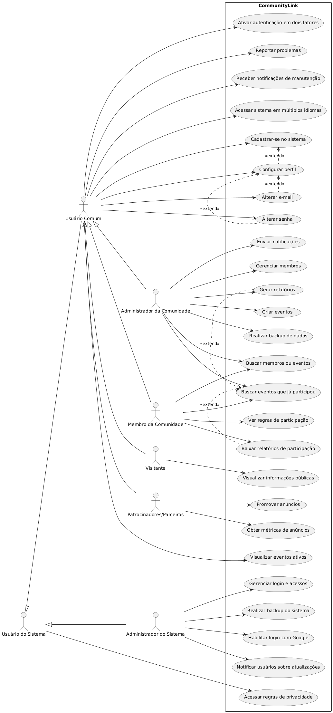

<h6>"Na prática e, no mínimo, nesta primeira etapa, será gerado um diagrama de casos de uso (geral) contendo caso de uso para cada um dos requisitos (a depender da análise)."</h6>

# Capa

---

<h1>Diagramas de Casos de Uso</h1>

<h2>CommunityLink</h2>

<small>Versão 1.0</small>

---

## Histórico de revisões

|    Data    | Versão |          Descrição          |      Autor       |
| :--------: | :----: | :-------------------------: | :--------------: |
| 11/02/2025 |  1.0   |    Criação do documento     | Ananda Guedes, Angélica Araújo, Letícia Leite e Maira Fernandes |

---

## Sumário

- [Capa](#capa)
  - [Histórico de revisões](#histórico-de-revisões)
  - [Sumário](#sumário)
- [Diagrama de Casos de Uso Geral](#diagrama-de-casos-de-uso-geral)
  - [Código UML](#código-uml)
  - [Especificação Descritiva dos Casos de Uso](#especificação-descritiva-dos-casos-de-uso)

---
## Diagrama de Casos de Uso Geral

**Figura 1** - Diagrama de Casos de Uso Geral do CommunityLink

## Código UML

[Ver código](uml-geral.md)

## Especificação Descritiva dos Casos de Uso

|    Data    | Versão |          Descrição          |      Autor       |
| :--------: | :----: | :-------------------------: | :--------------: |
| 16/01/2025 |  1.0   |    Criação do documento     | Ananda Guedes, Angélica Araújo, Letícia Leite e Maira Fernandes |

| Caso de Uso | Título                              | Objetivo                                                                                      | Requisitos | Atores                               | Condição de Entrada                                                                     |
| :---------: | :---------------------------------: | :-------------------------------------------------------------------------------------------: | :--------: | :----------------------------------: | :--------------------------------------------------------------------------------------: |
| UC01        | Criar eventos                       | Permitir que o ator crie eventos na plataforma para organização de atividades comunitárias.   | RF001      | Administrador da Comunidade          | O ator deve estar logado no sistema e acessar a opção de criar um novo evento.            |
| UC02        | Realizar backup de dados            | Permitir que o ator faça backup dos dados da plataforma para garantir a segurança da informação.| RF002      | Administrador da Comunidade          | O ator deve estar autenticado no sistema.                                                |
| UC03        | Enviar notificações                 | Permitir que o ator envie notificações para os membros informando sobre atualizações ou eventos.| RF003      | Administrador da Comunidade          | O ator deve estar autenticado no sistema.                                                |
| UC04        | Gerenciar membros                   | Permitir que o ator gerencie os membros cadastrados, podendo removê-los caso necessário.      | RF004      | Administrador da Comunidade          | O ator deve estar autenticado no sistema.                                                |
| UC05        | Gerar relatórios                    | Permitir que o ator gere relatórios sobre a participação dos membros em eventos e atividades. | RF005      | Administrador da Comunidade          | O ator deve estar autenticado no sistema e acessar a funcionalidade de relatórios.        |
| UC06        | Cadastrar-se no sistema             | Permitir que o ator crie uma conta na plataforma, fornecendo informações básicas.             | RF200      | Usuário Comum                        | O ator acessa a página de cadastro do sistema.                                           |
| UC07        | Visualizar eventos ativos           | Permitir que os atores visualizem os eventos disponíveis na plataforma.                       | RF201      | Usuário Comum                        | O ator acessa a plataforma e seleciona a opção ‘Eventos ativos’.                          |
| UC08        | Configurar perfil                   | Permitir que o ator edite suas informações pessoais e preferências dentro da plataforma.      | RF202      | Usuário Comum                        | O ator acessa a plataforma e seleciona a opção ‘Configurar perfil’.                       |
| UC09        | Buscar eventos que já participou    | Permitir que o ator encontre eventos anteriores em que esteve presente.                       | RF203      | Administrador da Comunidade, Membro  | O ator acessa a plataforma e seleciona a opção ‘Meus eventos’.                            |
| UC10        | Ver regras de participação          | Permitir que atores consultem as diretrizes e regras para participação em eventos.            | RF204      | Membro da Comunidade                 | O ator acessa a plataforma e seleciona a opção ‘Regras de participação’.                  |
| UC11        | Baixar relatórios de participação   | Permitir que atores façam o download de relatórios sobre sua participação em eventos.         | RF205      | Membro da Comunidade                 | O ator acessa a plataforma e seleciona a opção ‘Meus relatórios’.                         |
| UC12        | Buscar membros ou eventos           | Permitir que atores encontrem outros membros ou eventos dentro da plataforma.                 | RF206      | Administrador da Comunidade, Membro  | O ator acessa a plataforma e seleciona a opção ‘Buscar’.                                  |
| UC13        | Visualizar informações públicas     | Permitir que visitantes tenham acesso a informações públicas da plataforma.                   | RF300      | Visitante                            | O ator acessa a plataforma sem necessidade de login.                                     |
| UC14        | Promover anúncios                   | Permitir que o ator promova anúncios na plataforma para divulgar produtos e serviços.         | RF400      | Patrocinadores/Parceiros             | O ator acessa a plataforma e seleciona a opção ‘Promover anúncios’.                       |
| UC15        | Obter métricas de anúncios          | Permitir que o ator obtenha métricas sobre o desempenho de seus anúncios.                     | RF401      | Patrocinadores/Parceiros             | O ator acessa a plataforma e seleciona a opção ‘Métricas de anúncios’.                    |
| UC16        | Gerenciar login e acessos           | Permitir que o administrador gerencie o acesso dos usuários à plataforma.                     | RF500      | Administrador do Sistema             | O ator acessa o painel de administração e seleciona a opção ‘Gerenciar login e acessos’.  |
| UC17        | Realizar backup do sistema          | Permitir que o administrador realize backups dos dados da plataforma.                         | RF501      | Administrador do Sistema             | O ator acessa a plataforma e seleciona a opção ‘Backup’.                                  |

